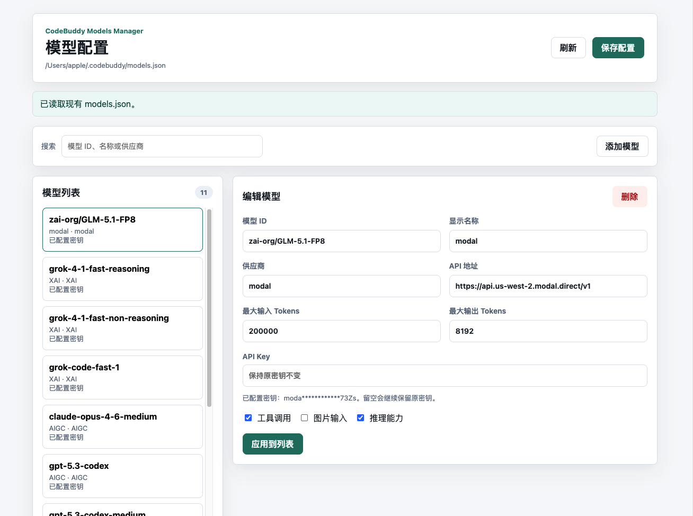
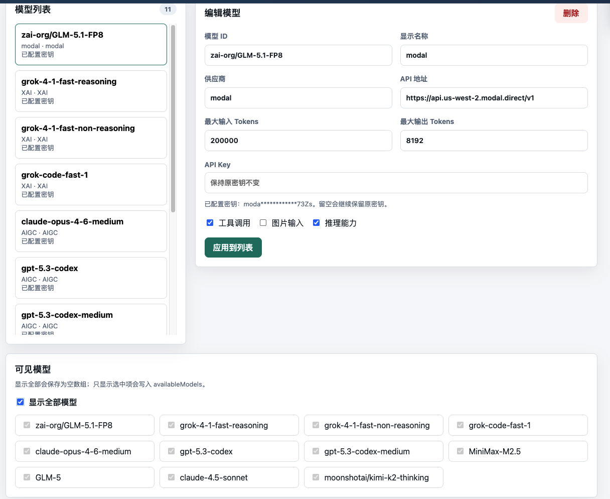

# CodeBuddy Models Manager

一个本地优先的 CodeBuddy `models.json` 可视化配置工具。

它会读取现有的 `models.json` 并展示到界面里。启动服务、打开页面、点击“刷新”都不会覆盖用户配置，只有点击“保存配置”时才会写回文件。写回前会自动备份原文件。



## 功能

- 查看现有模型列表
- 添加、删除、修改模型
- 刷新并重新读取本地配置
- 管理 `availableModels`
- 默认保留已有 API Key，不在界面明文回显
- 保存前校验配置
- 保存前自动备份
- 支持 Docker 部署
- 支持通过环境变量指定配置文件路径

## 界面预览

主界面会自动读取现有 `models.json`，左侧展示模型列表，右侧编辑当前模型。API Key 默认只显示掩码，留空保存时会继续沿用原密钥。


底部可以管理 `availableModels`。勾选“显示全部模型”时会保存为空数组；取消后可选择只显示指定模型。



## 本地启动

```bash
npm start
```

然后打开：

```text
http://127.0.0.1:4310/
```

默认读取：

```text
~/.codebuddy/models.json
```

这个路径下如果已经有模型配置，会直接显示在列表里；如果文件不存在，页面会显示空列表，直到你主动保存才会创建文件。

## 指定配置文件

```bash
CODEBUDDY_MODELS_PATH=/path/to/models.json npm start
```

或：

```bash
node server.js --config=/path/to/models.json
```

## Docker

```bash
docker compose up --build
```

或直接运行：

```bash
docker run --rm \
  -p 4310:4310 \
  -v ~/.codebuddy:/data \
  -e CODEBUDDY_MODELS_PATH=/data/models.json \
  codebuddy-models-manager
```

## 环境变量

| 变量 | 默认值 | 说明 |
| --- | --- | --- |
| `HOST` | `127.0.0.1` | 监听地址 |
| `PORT` | `4310` | 监听端口 |
| `CODEBUDDY_MODELS_PATH` | `~/.codebuddy/models.json` | 配置文件路径 |
| `READONLY` | `false` | 设置为 `true` 后只读 |

## 安全说明

- 页面不会默认展示完整 API Key。
- 未修改 API Key 时，保存会自动沿用原文件里的值。
- 服务默认只监听 `127.0.0.1`。
- 每次保存前会在配置文件同级的 `backups/` 目录创建备份。

## CodeBuddy 配置语义

- `models` 会按模型 `id` 合并，同 `id` 覆盖。
- `availableModels` 为空数组时表示显示全部模型。
- `availableModels` 非空时表示只显示数组里的模型。
- 项目级 `.codebuddy/models.json` 优先级高于用户级 `~/.codebuddy/models.json`。
